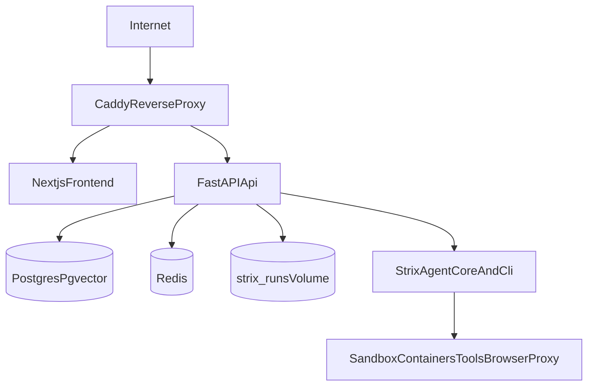
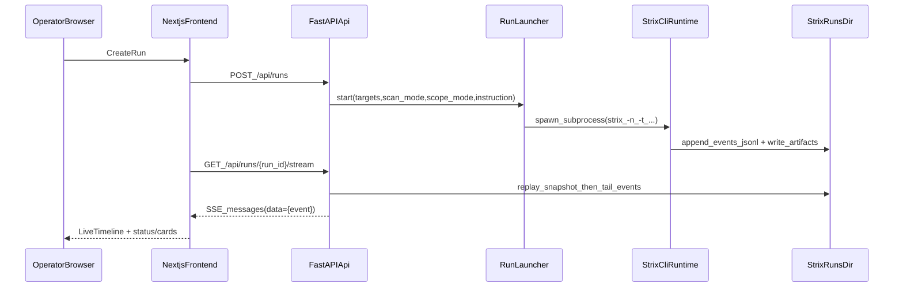

# NovaHunter — Project Overview (Deep Dive)

NovaHunter is a **self-hosted, AI-driven offensive-security control plane**. It combines:

- A **Next.js dashboard** (`frontend/`) for operators (runs, findings, reports, analytics, admin).
- A **FastAPI backend** (`strix/api/`) exposing REST + SSE/websocket-style streaming APIs and orchestration.
- The **Strix agent runtime** (`strix/`) that actually performs scans by spawning a sandboxed tool environment.
- A production-ish **Docker Compose deployment** (`deploy/`) fronted by **Caddy** (single public port).

NovaHunter is a fork of the open-source Strix project and keeps the original Strix CLI intact, while adding a full web control plane and deployment stack.

> **Ethics / legality**: this is an offensive-security platform. Only test systems you own or have explicit permission to test.

---

## Table of contents

- [System design](#system-design)
  - [Topology (containers + network boundaries)](#topology-containers--network-boundaries)
  - [Core data model: files as truth, DB as index](#core-data-model-files-as-truth-db-as-index)
  - [Run lifecycle (end-to-end)](#run-lifecycle-end-to-end)
  - [Streaming model (SSE)](#streaming-model-sse)
  - [Sidechannels (VNC / shell / Burp / VPN / listeners)](#sidechannels-vnc--shell--burp--vpn--listeners)
  - [Nova “swarm blackboard” (pgvector)](#nova-swarm-blackboard-pgvector)
  - [LLM configuration + role routing](#llm-configuration--role-routing)
  - [Auth & RBAC](#auth--rbac)
- [Repository layout](#repository-layout)
- [Backend (FastAPI) architecture](#backend-fastapi-architecture)
- [Frontend (Next.js) architecture](#frontend-nextjs-architecture)
- [Persistence & storage](#persistence--storage)
- [Deployment & operations](#deployment--operations)
- [Development workflows](#development-workflows)
- [Security posture & risk notes](#security-posture--risk-notes)
- [Glossary](#glossary)

---

## System design

### Topology (containers + network boundaries)

Deployed via Docker Compose (`deploy/docker-compose.yml`) and fronted by Caddy (`deploy/Caddyfile`).

Key properties:

- **Only Caddy publishes host ports** (80, and 443 if HTTPS is enabled later).
- `frontend`, `api`, `postgres`, and `redis` live on an internal bridge network (`strix_net`).
- The API launches scans by spawning the Strix CLI as a subprocess, which then talks to Docker to create **sandbox containers**.

Mermaid view of the default deployment:

Routing contract in Caddy (`deploy/Caddyfile`), summarized:

- `/api/health` → `frontend` (Next.js route handler)
- `/api/*` → `api`
- `/healthz`, `/readyz` → `api`
- `/ws` and `/ws/*` → `api` (streaming / websocket endpoints)
- `/runs/{run_id}/(vnc|shell|burp|ovpn|listeners)/*` → `api` (sidechannels passthrough)
- Everything else → `frontend`

---

### Core data model: files as truth, DB as index

NovaHunter uses a **file-backed source-of-truth** for each scan “run”. The Strix tracer writes run artifacts to:

- `STRIX_RUNS_DIR/<run_id>/events.jsonl` (**append-only truth source**)
- `STRIX_RUNS_DIR/<run_id>/penetration_test_report.md`
- `STRIX_RUNS_DIR/<run_id>/vulnerabilities/*.md`
- `STRIX_RUNS_DIR/<run_id>/checkpoints/ckpt-*.json` (crash-safe snapshots)

The FastAPI backend reads these artifacts to materialize API responses (see `strix/api/services/run_store.py`).

When Postgres is enabled, NovaHunter additionally creates and maintains tables that function as:

- **Index / metadata store**: orgs/users/runs/findings index, audit log
- **Operator config store**: LLM role routes, encrypted secrets, integrations, schedules, MCP registry/tokens
- **Nova blackboard store**: run-scoped `nova_findings` + pheromone decay view (`nova_findings_scored`)

This “files-first” design is why the platform can run in multiple modes:

- **File-only**: no Postgres, no Redis (single-node friendly)
- **Redis-only**: distributed rate-limits + pub/sub, still file-backed artifacts
- **Postgres + Redis**: multi-tenant / indexed / admin-heavy deployment

(See `strix/api/services/db.py`.)

---

### Run lifecycle (end-to-end)

At a high level:

1. Operator creates a run from the dashboard.
2. Frontend calls `POST /api/runs` (FastAPI).
3. API validates input and starts a run by spawning the **Strix CLI** as a subprocess.
4. Strix CLI writes `events.jsonl` and artifacts into the run directory.
5. Dashboard navigates to `/runs/{run_id}` and opens the event stream to show the run live.

Sequence diagram (simplified):

Implementation anchors:

- Subprocess orchestration: `strix/api/services/run_launcher.py`
  - Creates a run id + directory, writes a `run.pid` file, and captures stdout/stderr to `runner.log`.
  - Also runs an exit watcher so “failed early” runs are surfaced even if no events were written.
- API surface for runs and live control: `strix/api/routes/runs.py`
  - `POST /api/runs` creates a run and returns either a real summary (once events appear) or a queued skeleton.
  - `POST /api/runs/{run_id}/control` supports `pause|resume|kill` using OS-level signals.
- Read-side run materialization: `strix/api/services/run_store.py`
  - Reads `events.jsonl`, infers status, aggregates stats/tokens/cost, collects tool executions, agents, and findings.

---

### Streaming model (SSE)

Live updates are delivered through **Server-Sent Events**:

- `GET /api/runs/{run_id}/stream` replays the current snapshot first (so the UI can fast-forward), then tails `events.jsonl` for new events.
- The frontend attaches the stream only while the run is in-flight (e.g. `queued`, `running`, `throttled`) and **debounces refetch** to avoid hammering `GET /api/runs/{id}` on noisy runs.

Anchors:

- Backend stream endpoint: `strix/api/routes/runs.py` (`/stream`)
- Frontend stream consumption: `frontend/src/app/(app)/runs/[runId]/page.tsx`
- Provider implementation: `frontend/src/lib/api/api-provider.ts` (`streamRunEvents`)

---

### Sidechannels (VNC / shell / Burp / VPN / listeners)

NovaHunter exposes “operator cockpit” features (live browser, terminals, Burp panel, etc.) via **run-scoped sidechannels**.

How it works:

- The dashboard asks the API for sidechannel URLs: `GET /api/runs/{run_id}/sidechannels`.
- The API returns short-lived URLs containing a signed token (`token=...`).
- Caddy routes sidechannel paths `/runs/{run_id}/...` back to the API (`deploy/Caddyfile`).

Anchors:

- Token minting: `strix/api/routes/sidechannels.py`
  - Uses HMAC over a JSON payload with issuer/audience/run/user/org and `exp` (15 minutes).
  - Secret source: `STRIX_SIDECHANNEL_SECRET` or fallback `STRIX_MASTER_KEY` (dev fallback exists).
- Proxy routing: `deploy/Caddyfile` (sidechannel regexp)
- Frontend usage: `frontend/src/app/(app)/runs/[runId]/page.tsx` (fetches VNC URL)

---

### Nova “swarm blackboard” (pgvector)

NovaHunter adds a run-scoped **blackboard** (“shared findings”) that agents can write to and read from during a run.

Storage and scoring:

- Postgres table: `nova_findings`
  - Includes `pheromone` and `half_life_seconds`
  - Includes optional `embedding vector(1536)` (pgvector enabled)
- View: `nova_findings_scored`
  - Computes `effective_pheromone` as a decay function without rewriting rows.

Agent integration:

- During each agent iteration, the root loop injects the top blackboard items into the conversation context (best-effort; no Postgres means empty).

Anchors:

- Schema: `strix/api/services/db.py` (`nova_findings`, `nova_findings_scored`)
- Blackboard API: `strix/api/routes/blackboard.py` (`GET /api/runs/{run_id}/blackboard`)
- Runtime blackboard client: `strix/nova/blackboard.py`
- Agent injection: `strix/agents/base_agent.py` (injects `<swarm_blackboard>...</swarm_blackboard>`)
- UI panel: `frontend/src/components/runs/blackboard-panel.tsx`

---

### LLM configuration + role routing

NovaHunter treats LLM configuration as **server-authoritative**, because scans are launched by the backend and executed by the Strix subprocess.

Two layers:

1. **Default provider config** (model + api base + API key + reasoning effort)
   - Read/write/test endpoints under `/api/llm/*`
   - Stored by the backend (file-backed store under runs dir; the UI never gets secrets back after saving)
2. **Role router** (“planner/executor/reasoner/reporter/vision/…”) with per-role model routes
   - Managed through admin endpoints and stored in Postgres when enabled.
   - The Strix LLM layer calls `get_router().prepare_completion_args(role, args)` before every completion.

Anchors:

- Backend persisted config + test calls: `strix/api/routes/llm.py`
- Admin role router endpoints + secrets store: `strix/api/routes/admin.py`
- Router usage inside LLM streaming: `strix/llm/llm.py`
- Frontend settings UI: `frontend/src/app/(app)/settings/page.tsx`

---

### Auth & RBAC

Authentication modes:

- **Development / demo**: if Clerk is not configured, the API returns a permissive demo principal.
- **Production**: `STRIX_ENV=production` requires Clerk auth to be configured; otherwise the API refuses to start (see `strix/api/app.py`).

Principal construction:

- Verifies Clerk JWT against JWKS (`CLERK_JWKS_URL`, `CLERK_ISSUER`; optional `CLERK_AUDIENCE`).
- Maps claims to an internal `Principal` with `role`, `org_id`, `org_slug`, `email`, etc.
- Supports optional `X-API-Key` (`strx_...`) for service-to-service / PAT style auth.

RBAC roles:

- `viewer`: read-only
- `analyst`: create runs, send messages, stop agents/runs
- `admin`: org-scoped admin
- `platform-admin`: cross-tenant admin and system-health visibility (audited)

Anchors:

- `Principal` + Clerk verification + API key support: `strix/api/services/auth.py`
- Admin-only surfaces: `strix/api/routes/system.py`, `strix/api/routes/admin.py`

---

## Repository layout

Top-level map (most relevant directories):

- `frontend/`: Next.js 16 dashboard (React 19.x), demo mode + live API provider.
- `strix/`: Strix agent runtime + tools + LLM wrapper + telemetry.
  - `strix/api/`: FastAPI backend + services + schema + routes.
  - `strix/nova/`: NovaHunter additions (e.g. blackboard).
- `deploy/`: docker compose stack, Caddy reverse proxy config, `.env.example`.
- `scripts/`: installer (`setup.sh`) and helpers.
- `docs/`: install/ops docs and reporting templates.

---

## Backend (FastAPI) architecture

Entry point:

- App factory and router wiring: `strix/api/app.py`

Routers (high-signal, not exhaustive):

- Runs + streaming: `strix/api/routes/runs.py`
- Findings + report exports: `strix/api/routes/findings.py`
- LLM config: `strix/api/routes/llm.py`
- Sidechannels: `strix/api/routes/sidechannels.py`
- Nova blackboard: `strix/api/routes/blackboard.py`
- Admin: `strix/api/routes/admin.py` (LLM role routes, secrets, org/audit/rate-limits)
- System health (admin): `strix/api/routes/system.py`
- Integrations: `strix/api/routes/integrations.py`
- MCP registry/tokens: `strix/api/routes/mcp.py`

Services:

- Run launcher: `strix/api/services/run_launcher.py`
- Run store: `strix/api/services/run_store.py`
- Postgres/Redis lazy clients + schema bootstrap: `strix/api/services/db.py`
- Retention sweeper: `strix/api/services/retention.py`
- Scheduler loop: `strix/api/services/schedules.py`

Health:

- `/healthz`: cheap liveness (always OK if process responds)
- `/readyz`: readiness that probes Postgres, Redis (if enabled), and runs dir
- `/api/system/health`: admin-only deep health snapshot (probes + env audit + metrics)

Anchors:

- Readiness/liveness: `strix/api/routes/health.py`
- System health snapshot: `strix/api/routes/system.py`, `strix/api/services/system_health.py`

---

## Frontend (Next.js) architecture

Major concepts:

- **Demo vs Live** provider split: avoids accidentally hitting the real backend when in demo mode.
- `ApiProvider` implements the typed contract for the FastAPI backend.
- Live run UX uses:
  - SSE stream for timeline events
  - Periodic polling as a backstop (run details cards stay fresh)
  - Sidechannels (e.g. VNC URL minted by API)
  - Dedicated panels (e.g. blackboard panel)

Anchors:

- Real API provider: `frontend/src/lib/api/api-provider.ts`
- Provider interface/types: `frontend/src/lib/api/provider.ts`, `frontend/src/lib/types.ts`
- Run detail page + live stream: `frontend/src/app/(app)/runs/[runId]/page.tsx`
- Settings (server-authoritative LLM config): `frontend/src/app/(app)/settings/page.tsx`

---

## Persistence & storage

### File-backed runs directory (`STRIX_RUNS_DIR`)

Mounted into the API container as `/data/strix_runs` (compose volume `strix_runs`).

This directory holds:

- Append-only event stream (`events.jsonl`)
- Generated report markdown
- Finding/vulnerability markdown and evidence
- Checkpoints for crash-safe resume
- Local config fallback files (e.g. LLM config, MCP registry fallback) when Postgres is unavailable

### Postgres (optional but recommended)

Used for:

- Multi-tenant metadata and indexes
- Secrets store (AES-GCM) keyed by `STRIX_MASTER_KEY`
- LLM route overrides and per-run budgets
- Schedules, integrations, MCP registry/tokens
- Nova blackboard tables + pgvector extension

Schema bootstrap: `strix/api/services/db.py` (`ensure_schema()`).

### Redis (optional but recommended)

Used for:

- Rate-limits and ephemeral counters
- Pub/sub for multi-worker streaming and governance-like features

---

## Deployment & operations

Primary deployment path:

- One-shot installer: `scripts/setup.sh` (documented in `docs/INSTALL_UBUNTU.md`)

Manual compose:

- `deploy/docker-compose.yml` + `deploy/.env`
- Example template: `deploy/.env.example`

Operational highlights:

- Health checks:
  - Public: `/api/health` (frontend), `/healthz` and `/readyz` (API)
- Backups:
  - Postgres dumps + tar of `strix_runs` volume (see `deploy/README.md` / `docs/INSTALL_UBUNTU.md`)
- Retention:
  - Background sweep deletes old runs and trims evidence dirs by size (`strix/api/services/retention.py`)
- Schedules:
  - Minimal cron-like scheduler backed by Postgres table `strix_scan_schedules` (`strix/api/services/schedules.py`)

---

## Development workflows

### Frontend

- `frontend/` is a standard Next.js App Router application.
- Scripts: see `frontend/package.json` (`dev`, `build`, `start`, `lint`, `type-check`).

### Backend

- FastAPI app is in `strix/api/`.
- In a “realistic” dev setup you typically run the backend using docker compose (so Postgres/Redis are there).
- The API is designed to degrade gracefully when Postgres/Redis are not configured.

### CLI / agent runtime

- The Strix CLI entrypoint is `strix` (configured in `pyproject.toml`).
- The API reuses the CLI orchestration by spawning it as a subprocess for each run.

---

## Security posture & risk notes

- **Public exposure**: Only Caddy is exposed; Postgres and Redis are internal.
- **Docker socket**: The API container mounts `/var/run/docker.sock` and is therefore highly privileged relative to the host.
  - This is required for “spawn sibling sandbox containers”.
  - Treat the host as a hardened single-purpose box and restrict who can access the platform.
- **Sidechannels**: URLs are minted with short-lived signed tokens; protect `STRIX_MASTER_KEY` / `STRIX_SIDECHANNEL_SECRET`.
- **Production auth**: API refuses to start in production without Clerk configured (`strix/api/app.py`).

---

## Glossary

- **Run**: a single scan execution. Materialized from `STRIX_RUNS_DIR/<run_id>/events.jsonl`.
- **Artifact**: a file produced under a run directory (report, vulnerabilities, evidence, checkpoints).
- **Checkpoint**: a crash-safe snapshot of run state, written periodically.
- **SSE**: Server-Sent Events used to tail `events.jsonl` live to the browser.
- **Sidechannel**: a run-scoped operator UI tunnel (VNC, shell, Burp, VPN, listeners).
- **Sandbox**: per-run tool environment container(s) used by agents (browser automation, proxy tools, terminals).
- **Blackboard**: shared run-scoped findings store (Postgres) used to coordinate agents.
- **Role route**: LLM router mapping from role (planner/executor/etc.) to model/provider config.

